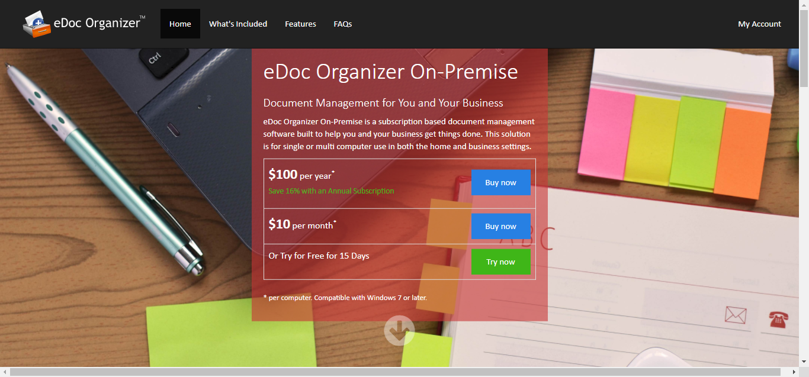
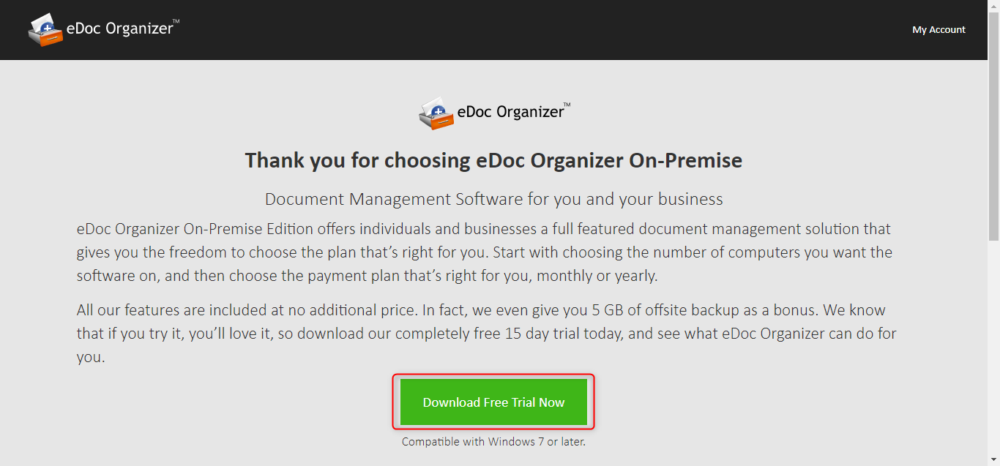

**Note: Before you purchase eDoc Organizer, you can download a full trial free for 15 days.**
 
You can download and install eDoc Organizer from our web site home page. Installing eDoc Organizer is very easy. If you have any problems in the installation process, please contact our [technical support team](mailto:support@edocllc.com).
 
**Note: Before installing eDoc Organizer, please refer to the [System Requirements](http://edocorganizer-help.azurewebsites.net/overview/system-requirements) section.**
 
To download either edition of eDoc Organizer, simply follow the steps given below.

# On-Premise
 
1. Navigate to the eDoc Oganizer On-Premise home page by entering the URL, [http://on-premise.edocorganizer.com/](http://on-premise.edocorganizer.com/)on your browser's address bar.

The eDoc Organizer On-Premise Home page will be displayed.

2. Click on **Try now** to go to the download page for On-Premise trial. 

3. Click the **Download Free Trial Now** link. The dialog box asking you to save the file will be displayed.

4. The Download progress will show. Open your **Downloads** folder when the download is complete.