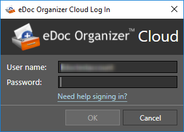

[ui-tabs position="top-left" active="0" theme="default"]
[ui-tab title="On-Premise Edition"]
**Note: Before you purchase eDoc Organizer, you can download a full trial free for 15 days.**
 
You can download and install eDoc Organizer from our web site home page. Installing eDoc Organizer is very easy. If you have any problems in the installation process, please contact our [technical support team](mailto:support@edocllc.com).
 
**Note: Before installing eDoc Organizer, please refer to the [System Requirements](https://help.edocorganizer.com/overview/system-requirements) section.**
 
To download the On-Premise edition of eDoc Organizer, simply follow the steps given below.
 
1. Navigate to the eDoc Oganizer On-Premise home page by entering the URL, [http://on-premise.edocorganizer.com/](http://on-premise.edocorganizer.com/) on your browser's address bar.

The eDoc Organizer On-Premise Home page will be displayed.

2. Click on **Try now** to go to the download page for On-Premise trial. 

3. Click the **Download Free Trial Now** link. The dialog box asking you to save the file will be displayed.

4. The Download progress will show. Open your **Downloads** folder when the download is complete.

5. Double-click on the installer to start installation.

6. Follow the steps to install On-Premise.

7. After successfull installation, click **Run eDoc Organizer On-Premise** to start the program.

8. Upon launching the program, you'll be prompted to configure the eDoc Organizer On-Premise Manager. Click the **Configure eDoc Organizer** button to start.

9. Once you have set up the basic manager, the Manager page will display. Here you can configure your backup, and change the default location of your documents if you like. Once you are satisfied with the options, start eDoc Organizer to begin.

10. eDoc Organizer On-Premise will display. **Note: It will show as a trial version until it has been activated. The date will display how long is left in the trial.**

[/ui-tab]
[ui-tab title="Cloud Edition"]
**Note: Before you purchase eDoc Organizer, you can download a full trial free for 15 days.**
 
You can download and install eDoc Organizer from our web site home page. Installing eDoc Organizer is very easy. If you have any problems in the installation process, please contact our [technical support team](mailto:support@edocllc.com).
 
**Note: Before installing eDoc Organizer, please refer to the [System Requirements](https://help.edocorganizer.com/overview/system-requirements) section.**
 
To download the Cloud edition of eDoc Organizer, simply follow the steps given below.

1. Navigate to the eDoc Oganizer Cloud home page by entering the URL, [http://cloud.edocorganizer.com/](http://cloud.edocorganizer.com/) on your browser's address bar, and click on "Sign Up" or "Start your free 15 day trial today" at the bottom. 

2. Fill out the required information, such as how many computers, the kind of Cloud account you want, to get started. For security purposes, you will need to provide a credit card, but it will not be charged until the end of the 15 day trial.

3. Once the account is created and signed up, you can log into your Cloud account and see the options available online. There are links to the the Windows Cloud Client and Mac Cloud Client with instructions on how to install them.

4. To use the Windows Cloud Client, launch the Client once it has installed.

5. Input your Cloud username and password, the same one you chose for step 2.

6. Once the credentials are successful, it will launch the Cloud Client.

[/ui-tab][/ui-tabs]