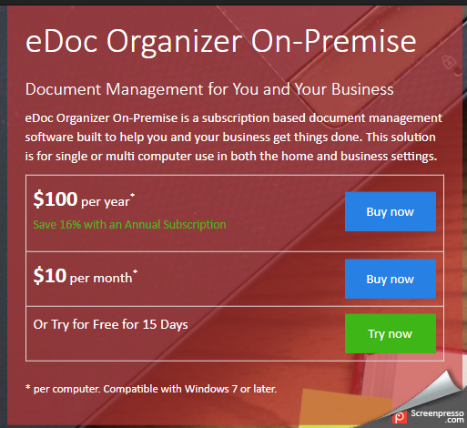
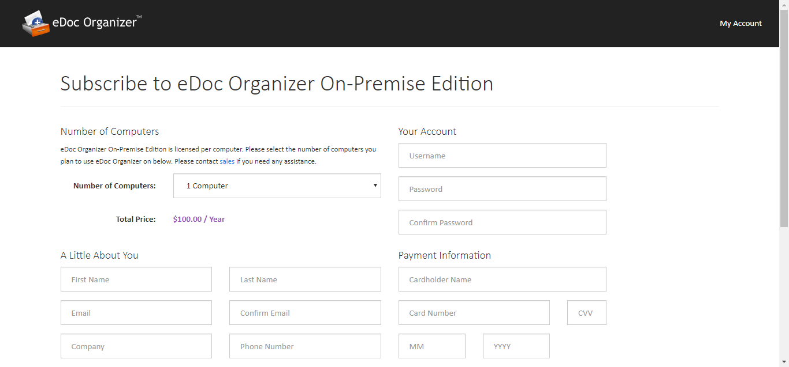
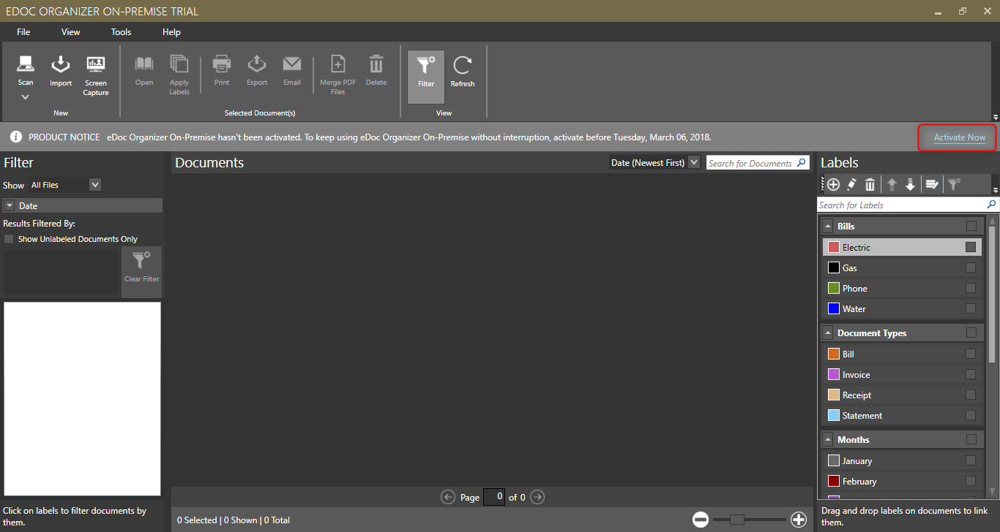
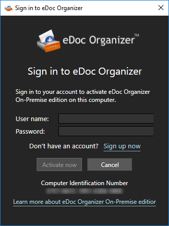
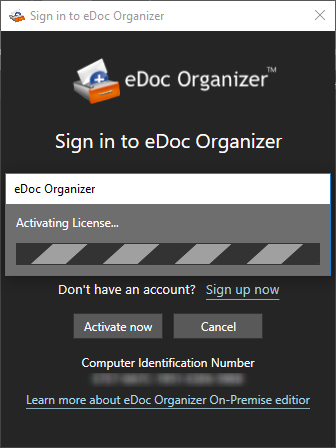
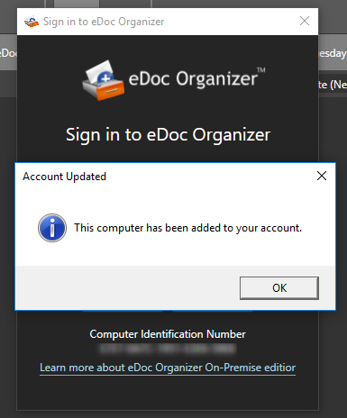

# On-Premise

Once you have downloaded the trial version of On-Premise, you can use that version for 15 days free of cost. You must purchase and register the product before 15 days to make sure that the trial version doesn’t expire and you lose access to your valuable files.

1. To purchase your copy of On-Premise, navigate to [http://on-premise.edocorganizer.com](http://on-premise.edocorganizer.com) and click on "Buy Now." You can choose the $10/month subscription, or the $100/year subscription.

2. Fill out the required information, including how many computers will be licensed for On-Premise. You will also be prompted to fill out your account information, which will be used to access your online account as well as On-Premise on your computer.

3. Once your online account is created, navigate back to On-Premise on your computer, and click on the "Activate" link on the right side.

4. The following pop up screen will appear, prompting you to put in your username and password. It is the same username and password you selected for step 2.

5. Activate, and you will receive a prompt once successful, along with a confirmation email.

