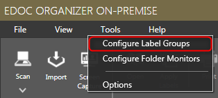
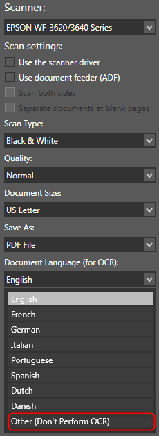

**1. Can I create sub-labels like sub-folders in Windows?**

No. eDoc Organizer labels are very different from folders in Windows and so having many levels of sub-labels would not be ideal for organization within eDoc Organizer. eDoc Organizer helps you map a single document to several labels. So for example, when you scan a bill for Patient A in 2011, rather than storing it in a particular folder and then later trying to find which folder you saved it in, you simply apply the **Patient A**, **Bills**, and **2011** labels to it in eDoc Organizer. When you need to find a document, you can start by searching for the broadest category, let’s say **patient A**, and narrow it down until a few documents are shown on your screen. Then you can typically just pick the right one based on the thumbnails shown.

By intentionally preventing multi-level label organization, we are trying to prevent our users from falling into the same age old failed paradigm of organizing document by having folders under folders under folders and a particular file with a specific name. There is only one level of labels in eDoc Organizer and they are all the same. Each label defines an attribute of a document and together they give you a complete picture of what a document actually is. So, there is no redundancy, yet you have better organization and every document can be easily traceable.

For more details please refer to the [Organizing Documents](https://edocorganizer-help.azurewebsites.net/overview/organizing-documents) section.

**2. When I create a new label within a label group, it is placed on the top of the list of labels in that group. Instead of using Moving Down option, can I automatically place it in alphabetical order?**

Yes. A Label Group can be either sorted Alphabetically or Manually. If you are using the manual option, a new label is always created on the top once it is created.

1. To reset it to alphabetical sorting, navigate to _**Tools > Configure Label Groups**_. The _**Configure Label Groups**_ dialog will be displayed.

2. Select the label group that you wish to reset.
3. Click the _**Reset**_ button on the tool bar.

The Label group is reset to sort alphabetically until you use the up and down arrows again to switch it to manual sorting.

**3. How do I selectively turn off OCR feature on certain documents?**

You can turn off OCR by selecting the _**Other (Don't perform OCR)**_ option from the OCR language dropdown from the Scan Document Wizard dialog box.

**4. How do I know the file name of a document stored in eDoc Organizer? How do I know the size of the document stored under eDoc Organizer?**

If you hover over a document thumbnail, a tooltip with the document name and size will be shown.

**5. Why can’t I find documents in eDoc Organizer using the text within them?**

There are a couple of things to check when you are not able to find the document by its content even after you performed the OCR.

● The OCR recognized the word that you are searching the document by correctly. To do that, just open the document in eDoc Organizer and use the search function at the bottom of the PDF viewer. If the search finds the words you are looking for, the document should be searchable from the main screen.

● Windows Search is installed and enabled on your machine.

**6. I created a Label Group using the configure label groups dialog and I don’t see it in the labels panel on the right hand side of the screen.**

When you add a new label group it doesn’t automatically appear in the Labels panel on the right hand side of the main window until there is a label attached to the new label group.

On the _**Labels Panel**_, click the _**Add**_ button to add a new label. The _**Create Label**_ dialog will be displayed.

**7. On the left side where it shows Labels and Filters, they seem to be out of order and wondered how I move them?**

The labels of the left hand side in the _**Filter Panel**_ are alphabetically sorted and vary in size depending upon how many documents have that label applied to them. The labels that appear in that list also change based what other searches  or filtering you have already done in the program. Think of it as a list of labels (along with their relevance) that are applied to the documents that are within your search (or all documents if you are not searching or filtering anything). It is just one more tool to help you narrow down your search and find the document you are looking for quickly.

**8. Why do some toolbar buttons seem to be disabled and not available? I want to merge PDF files, but the button is not enabled?**

Some tool bar buttons are disabled because their action can be initiated only when you select the required document. Specifically to merge pdf files, you need to select more than one document of unencrypted PDF formats.

**9. Where does eDoc Organizer store all its data on my computer?**

By default, On-Premise stores its database and document repository under **C:\ProgramData\eDoc LLC\eDoc Organizer\Documents**. You can change this option by opening eDoc Organizer Manager and choosing a different location. Cloud stores the documents on secure Microsoft Azure servers.

**10. How does eDoc store documents? More specifically, is there a proprietary format such that I will always need eDoc to view, edit and transport my data store or will I be able to open my files in Windows Explorer or some other compatible file manager?**

eDoc Organizer does not store documents in a proprietary format. All scanned documents are stored as a standard format PDF or picture format that can be open with any PDF reader or picture editor. Imported files retain their format during the import process. So a picture imported as JPG remains as JPG when stored in eDoc Organizer document storage folder. You can open all documents stored in eDoc Organizer from Windows Explorer as well.