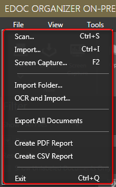
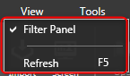
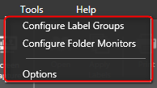
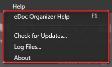

The _**Menu System**_ has four important menus: _**File**_, _**View**_, _**Tools**_ and _**Help**_. Each of these menus has several options or commands.

# File Menu

The _**File**_ menu has all the standard options of the _**eDoc Organizer**_ application. The options include Scan, Import, Screen Capture, Import Folder, OCR and Import, Export All Documents, Create Report, Backup, Restore and Exit.

# View Menu

The _**View**_ menu allows you to show or hide Filter Panel on the interface and Refresh command.

# Tools Menu

The _**Tools**_ menu allows you to configure Label Groups, Folder Monitors, and certain general options before you actually start working on _**eDoc Organizer**_.

# Help Menu

The _**Help**_ menu allows you to access eDoc Organizer Help and Log Files along with checking for new updates of eDoc Organizer. You can also identify the installed version number of the eDoc Organizer application.

