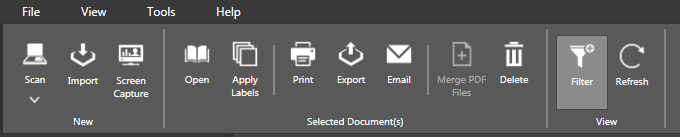
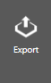
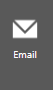
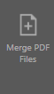
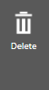
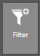

The Tool Bar provides quick access to various tasks that you can perform within the _**eDoc Organizer**_ application.

_Note: Some of the tasks/options in the Tool Bar are disabled and are enabled only when you select the document(s)._

The available options/tasks in the _**Tool Bar**_ are given below.

| **Icon**  | **Option/Task** | **Description** |
| ------------- | ------------- |
|  | Scan | To scan new documents |
|  | Import | To import existing documents from the computer |
|  | Screen Capture | To capture screenshots of the document or web pages on the computer |
|  | Open | To open the selected documents |
|  | Apply Labels  | To apply labels to the documents for categorization |
|  | Print | To print the selected documents |
|  | Export | To export the selected documents |
|  | Email  | To send selected documents via email |
|  | Merge PDF Files | To merge selected PDF files |
|  | Delete | To delete a selected document |
|  | Filter | To hde or show Filter Panel |
|  | Refresh | To refresh documents in the Document Workspace |