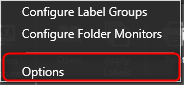
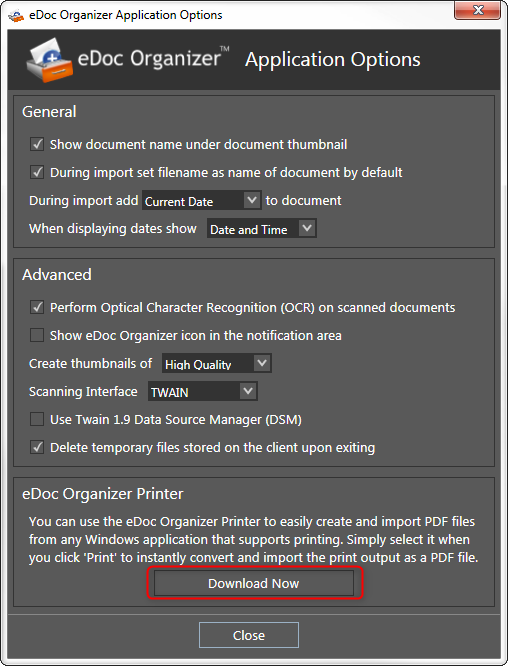
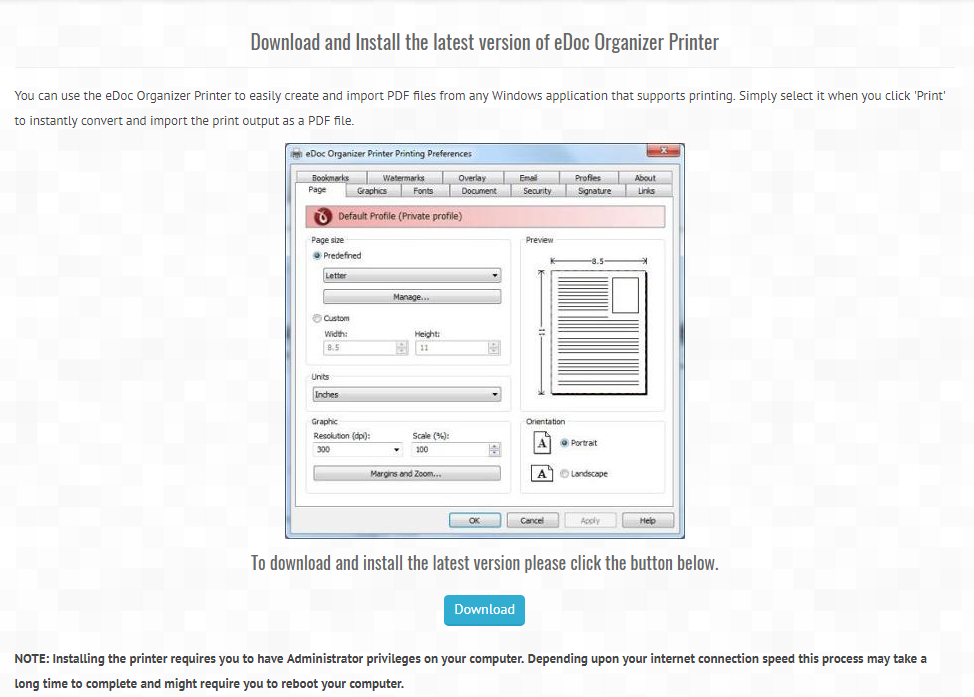
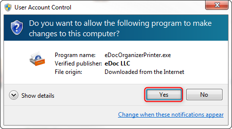

You can use the _**eDoc Organizer Printer**_ to easily create and import PDF files from any Windows application that supports printing.

1. To download _**eDoc Organizer Printer**_, navigate to _**Tools -> Options**_.

The _**eDoc Organizer Application Options**_ dialog box will be displayed.

2. Click the _**Download Now**_ button in the _**eDoc Organizer Printer**_ section at the bottom of the dialog box. You will be taken to the online download page of _**eDoc Organizer Printer**_.

3. Scroll down and click the _**Download**_ button. Depending on your browser and settings, the open dialog asking you to save the installation file will be displayed.

4. Click the _**Save File**_ button. The standard _**Save**_ dialog will be displayed, or will show in your browser bar where it is saved.

5. Select the location where you want to save the _**eDoc Organizer Printer**_ and then click the _**Save**_ button. The file starts downloading. Once the download is completed, open the downloaded printer installation file. The _**Open File**_ dialog will be displayed.

6. Click the _**Run**_ button.

7. The _**eDoc Organizer Printer**_ starts installing. Once the installation is complete, the successful message will be displayed. Click the _**OK**_ button.