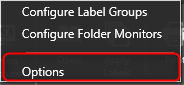

The _**Application Options**_ are the most basic and general options that can be configured before you start working with _**eDoc Organizer**_. Configuring the _**Application Options**_ is very easy. Simply follow the steps given below.

1. Navigate to _**Tools -> Options**_.

The _**eDoc Organizer Application Options**_ dialog box will be displayed.

# General Section

2. Checking the _**Show document name under document thumbnail**_ option allows you to display the name of the document below its thumbnail in the _**Document Workspace**_.  By default, this option is checked. Your _**Document Workspace**_ will display the name of the document below its thumbnail. Unchecking this option will remove the names of the documents.

3. You can select which date is applied to the documents while importing.  You can apply either the _**Current Date**_, the _**File Creation Date**_ or the _**File Modified Date**_.  Select the required date type from the drop down list.

4. You can also specify the format of the date displayed under the document thumbnail in the _**Document Workspace**_ as either the _**Date and Time**_ or the _**Date Only**_ format.  Select the desired date format from the drop down list.