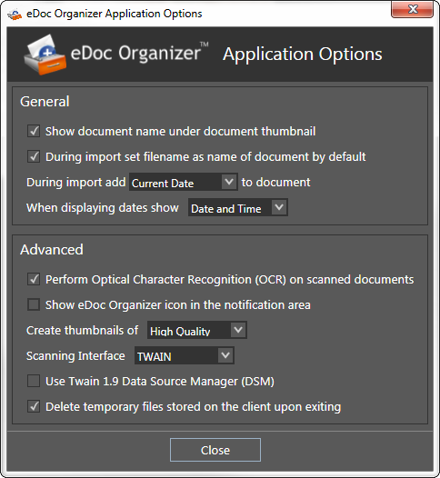

The _**Application Options**_ are the most basic and general options that can be configured before you start working with _**eDoc Organizer**_. Configuring the _**Application Options**_ is very easy. Simply follow the steps given below.

1. Navigate to Tools -> Options.

The _**eDoc Organizer Application Options**_ dialog box will be displayed.

