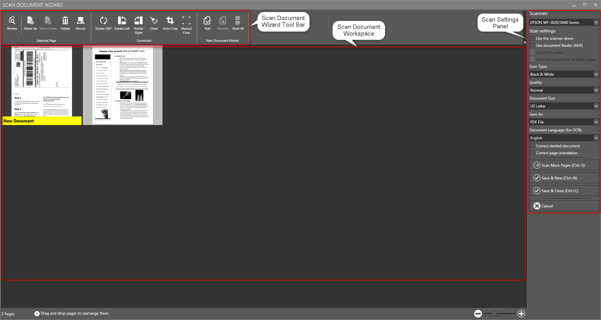

The _**Scan Document Wizard**_ has a very easy interface that lets you acquire image(s) from the scanner. The interface supports both the _**TWAIN**_ and _**WIA**_ standards.

[notice]Note: Before you start working with the Scan Document Wizard, configure the Scanning Interface. For more information on selecting the scan interface, refer to the [Configuring General Options](https://help.edocorganizer.com/understanding-the-interface/configuring-general-options) in the Understanding the Interface section.[/notice]

The _**Scan Document Wizard**_ has the following components:

●Scan Document Wizard Tool Bar

●Scan Document Workspace

●Scan Settings Panel

_**Scan Document Wizard Tool Bar**_

The _**Scan Document Wizard Tool Bar**_ provides quick access to various scan and image correction tasks that you can perform within the eDoc Organizer’s Scan Document Wizard.
 
[notice]Note: Some of the tasks/options in the Tool Bar are disabled and are enabled only when you select the scanned page.[/notice]