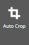
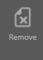

The _**Scan Document Wizard**_ has a very easy interface that lets you acquire image(s) from the scanner. The interface supports both the _**TWAIN**_ and _**WIA**_ standards.

[notice]Note: Before you start working with the Scan Document Wizard, configure the Scanning Interface. For more information on selecting the scan interface, refer to the [Configuring General Options](https://help.edocorganizer.com/understanding-the-interface/configuring-general-options) in the Understanding the Interface section.[/notice]

The _**Scan Document Wizard**_ has the following components:

●Scan Document Wizard Tool Bar

●Scan Document Workspace

●Scan Settings Panel

_**Scan Document Wizard Tool Bar**_

The _**Scan Document Wizard Tool Bar**_ provides quick access to various scan and image correction tasks that you can perform within the eDoc Organizer’s Scan Document Wizard.
 
[notice]Note: Some of the tasks/options in the Tool Bar are disabled and are enabled only when you select the scanned page.[/notice]

The available options/tasks in the _**Scan Document Wizard Tool Bar**_ are given below.

| **Icon**  | **Option/Task** | **Description** |
| ------------- | ------------- |
|  | Review | To review a scanned page |
|  | Move Up | To move up a scanned page in the list of all scanned pages |
|  | Move Down | To move down a scanned page in the list of all scanned pages |
|  | Delete | To delete a scanned page |
|  | Rescan  | To rescan a page |
|  | Rotate| To rotate the scanned page 180 degrees |
|  | Rotate Left | To rotate the scanned page to the left |
|  | Rotate Right | To rotate the scanned page to the right |
|  | Clean | To clean the scanned page |
|  | Auto Crop  | To remove or adjust the excess or the blank part of the scanned page |
|  | Manual Crop | To manually remove or adjust the excess or the blank part of the scanned page |
|  | Add | To mark the selected page as the start of a new document |
| | Remove | To hde or show Filter Panel |
|  | Mark All | To mark all selected documents for change |