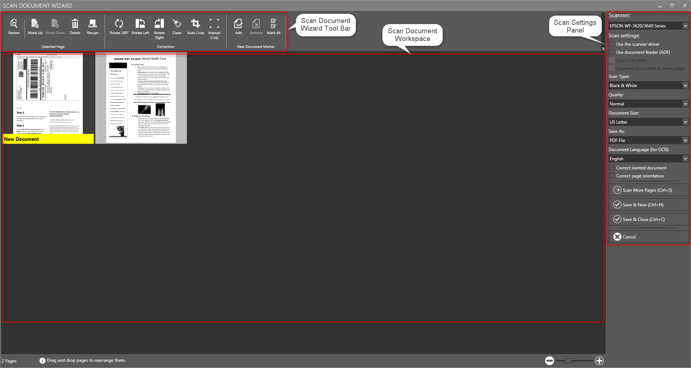
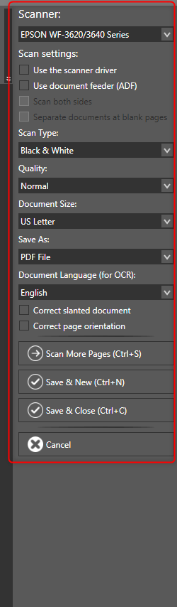

[notice]Note: Before you start working with the Scanner Document Wizard of eDoc Organizer, you must install the scanner on the computer and make sure that it is working well. [/notice]

Configuring a scanner on _**eDoc Organizer**_ is very easy. Simply follow the steps given below.

1. On the _**File**_ menu, click the _**Scan**_ option, or click the _**Scan**_ option in the _**Tool Bar**_.

The _**Scan Document Wizard**_ will be displayed.

The _**Scan Settings Panel**_ is available in the right section of the wizard. It allows you to manage all the scanner related settings such as Scanner, scanner type, document size, quality, saving format etc.

1. When a scanner is installed, it will be automatically listed in the _**Scanner**_ field. Select the required scanner from the _**Scanner**_ drop down list. In the example, _**Epson WF-3620/3640 Series**_ Scanner is selected. 

2.In the _**Scan Settings**_, you have 4 check boxes.

A.Checking the _**Use the scanner driver**_ option will use the default scanner driver installed for the scanner.

B.Checking the Use _**Automatic Document Feeder (ADF)**_ option will scan pages from your scanners ADF instead of the scanner's glass bed.

C.Some documents will have information on both the sides of the page. In such cases, you need to scan both the sides of the pages. Checking the _**Scan both the sides**_ option will scan both the sides of the page during scanning.

D.Checking the _**Separate documents at blank pages**_ option will cause eDoc Organizer to analyze each scanned page to see if it is blank or not. Whenever a blank page is found a new document marker will be automatically placed on the next page to mark the start of a new document.

[notice]Note: eDoc Organizer automatically checks your scanners capabilities and shows only the relevant options for your scanner in this section.[/notice]

3. The Scan Type indicates type of the scan that you wish to perform on the document. The available options are _**Black & White**_, _**Grayscale**_, and _**Color**_. Select the desired type of scan from the _**Scan Type**_ drop down list.

4. The _**Quality**_ field denotes the quality of scanning a document. The available options are Low, Normal and High. Select the desired quality from the Quality drop down list.

 

Note: High quality scanning is performed at 600 dpi, Normal scanning is performed at 300 dpi, and Low quality scans are performed at 150 dpi.

 

5.

The Document Size denotes the size of the scanning document. Select the appropriate size from the Document Size drop down list.

 

6.

The Save As option allows you to save the scanned document in two different format: a PDF File or a Photo. In the Photo format, all the pages are saved separately.  Select the required format for saving from the Save As drop down list.

 

7.

The Document Language (for OCR) specifies the language of the scanned document to use when performing OCR. The currently available languages are English, French, German, Italian, Spanish, Dutch and Other (Don’t Perform OCR). Select the required language for OCR in the Document Language drop down list.

 

8.

If the pages are not placed properly in the scanner for scanning, there are chances that we may get slanted during the scanning process. To correct such slanted documents, it is recommended you check the box besides the Correct slanted document option.

 

9.

The Scan button will activate the scanner and initiate the scanning process.

 

10.

The Cancel button will cancel the scanning process.

 

After scanning the first page, you will also find several additional buttons available for further scanning and saving tasks.