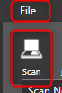
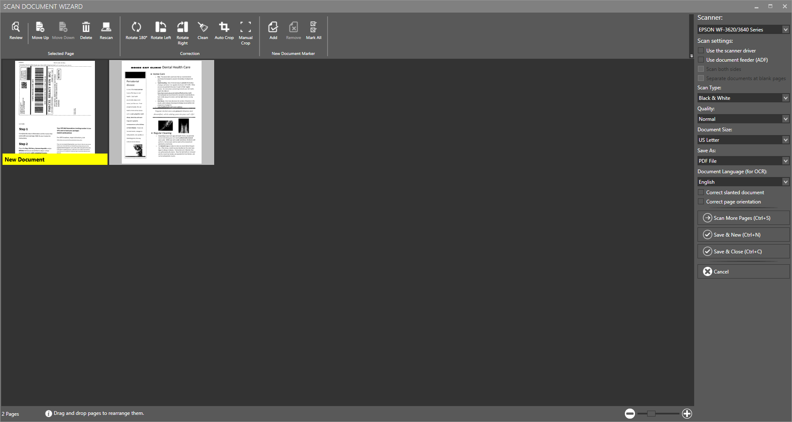

eDoc Organizer helps you to acquire documents or images directly from a scanner. Its _**Scan Document Wizard**_ has a simple and easy to use interface for facilitating collection of documents through scanning.

You can access the _**Scan Document Wizard**_ from either the File menu or the tool bar.

On the _**File**_ menu, click the _**Scan**_ option, or click the _**Scan**_ option in the Tool Bar.

The _**Scan Document Wizard**_ will be displayed.

