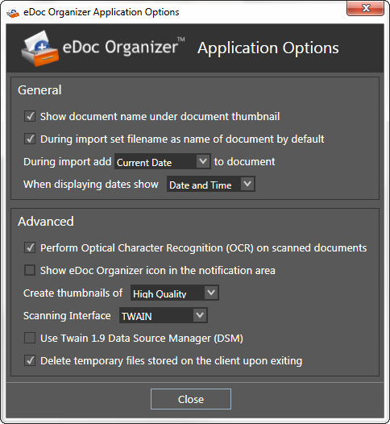

The _**Application Options**_ are the most basic and general options that can be configured before you start working with _**eDoc Organizer**_. Configuring the _**Application Options**_ is very easy. Simply follow the steps given below.

1. Navigate to _**Tools -> Options**_.

The _**eDoc Organizer Application Options**_ dialog box will be displayed.

# General Section

2. Checking the _**Show document name under document thumbnail**_ option allows you to display the name of the document below its thumbnail in the _**Document Workspace**_.  By default, this option is checked. Your _**Document Workspace**_ will display the name of the document below its thumbnail. Unchecking this option will remove the names of the documents.

3. You can select which date is applied to the documents while importing.  You can apply either the _**Current Date**_, the _**File Creation Date**_ or the _**File Modified Date**_.  Select the required date type from the drop down list.

4. You can also specify the format of the date displayed under the document thumbnail in the _**Document Workspace**_ as either the _**Date and Time**_ or the _**Date Only**_ format.  Select the desired date format from the drop down list.

# Advanced

5. Checking the _**Perform Optical Character Recognition (OCR) on scanned documents**_ option allows you to convert the scanned documents into searchable PDF format.  By default, this option is checked. If you do not want to create searchable PDF files from your scanned documents, you can simply uncheck the option to disable it.

6. Checking the _**Show eDoc Organizer icon in the notification area**_ box will display the _**eDoc Organizer**_ logo in the notification area. This allows you to close eDoc Organizer window without exiting the application. By default, this option is unchecked.

7. You can set the quality of the thumbnails created when documents are added to the eDoc Organizer database. The available options are _**Normal Quality**_ and _**High Quality**_. Select the desired thumbnail quality from the drop down list.

_**Note: Changing this option will not recreate or change the quality of the thumbnails that are already stored in the eDoc Organizer database.**_

8. The _**Scanning Interface**_ option decides which language _**eDoc Organizer**_ uses to talk to your scanner. The available options are _**TWAIN**_ and _**WIA**_.

* _**TWAIN**_ is the most common language for scanners. _**eDoc Organizer**_ works with scanners that follow the _**TWAIN**_ standard, which specifies how images are transferred from a scanner to a PC. This ensures wide compatibility, as most manufacturers ship TWAIN software with their scanners, or provide a free download.

* The _**Windows Image Acquisition (WIA)**_ is a new standard developed by Microsoft for scanner drivers.

* _**eDoc Organizer**_ supports the scan drivers of both of these standards. Select the desired scanning interface from the drop down list based on the type of the scanner that you are using.

9. Temporary files are used to help recover lost data if the program or computer is abnormally halted. By default, this box is checked and the file is saved normally and the temporary files are removed without causing issues to existing files.