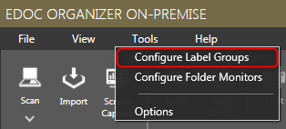
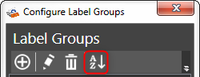
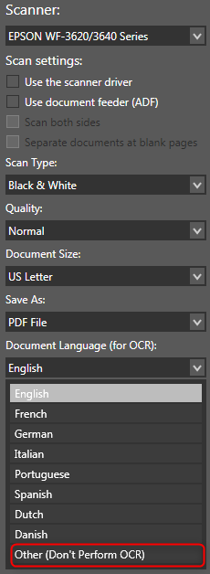
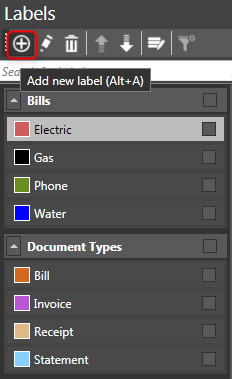
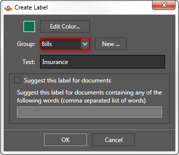

[ui-tabs position="top-left" active="0" theme="default"]
[ui-tab title="General FAQs about eDoc Organizer"]
**1. Can I create sub-labels like sub-folders in Windows?**

No. eDoc Organizer labels are very different from folders in Windows and so having many levels of sub-labels would not be ideal for organization within eDoc Organizer. eDoc Organizer helps you map a single document to several labels. So for example, when you scan a bill for Patient A in 2011, rather than storing it in a particular folder and then later trying to find which folder you saved it in, you simply apply the **Patient A**, **Bills**, and **2011** labels to it in eDoc Organizer. When you need to find a document, you can start by searching for the broadest category, let’s say **patient A**, and narrow it down until a few documents are shown on your screen. Then you can typically just pick the right one based on the thumbnails shown.

By intentionally preventing multi-level label organization, we are trying to prevent our users from falling into the same age old failed paradigm of organizing document by having folders under folders under folders and a particular file with a specific name. There is only one level of labels in eDoc Organizer and they are all the same. Each label defines an attribute of a document and together they give you a complete picture of what a document actually is. So, there is no redundancy, yet you have better organization and every document can be easily traceable.

For more details please refer to the [Organizing Documents](https://help.edocorganizer.com/overview/organizing-documents) section.

**2. When I create a new label within a label group, it is placed on the top of the list of labels in that group. Instead of using Moving Down option, can I automatically place it in alphabetical order?**

Yes. A Label Group can be either sorted Alphabetically or Manually. If you are using the manual option, a new label is always created on the top once it is created.

1. To reset it to alphabetical sorting, navigate to _**Tools > Configure Label Groups**_. The _**Configure Label Groups**_ dialog will be displayed.

2. Select the label group that you wish to reset.
3. Click the _**Reset**_ button on the tool bar.

The Label group is reset to sort alphabetically until you use the up and down arrows again to switch it to manual sorting.

**3. How do I selectively turn off OCR feature on certain documents?**

You can turn off OCR by selecting the _**Other (Don't perform OCR)**_ option from the OCR language dropdown from the Scan Document Wizard dialog box.

**4. How do I know the file name of a document stored in eDoc Organizer? How do I know the size of the document stored under eDoc Organizer?**

If you hover over a document thumbnail, a tooltip with the document name and size will be shown.

**5. Why can’t I find documents in eDoc Organizer using the text within them?**

There are a couple of things to check when you are not able to find the document by its content even after you performed the OCR.

● The OCR recognized the word that you are searching the document by correctly. To do that, just open the document in eDoc Organizer and use the search function at the bottom of the PDF viewer. If the search finds the words you are looking for, the document should be searchable from the main screen.

● Windows Search is installed and enabled on your machine.

**6. I created a Label Group using the configure label groups dialog and I don’t see it in the labels panel on the right hand side of the screen.**

When you add a new label group it doesn’t automatically appear in the Labels panel on the right hand side of the main window until there is a label attached to the new label group.

On the _**Labels Panel**_, click the _**Add**_ button to add a new label. 

The _**Create Label**_ dialog will be displayed.

**7. On the left side where it shows Labels and Filters, they seem to be out of order and wondered how I move them?**

The labels of the left hand side in the _**Filter Panel**_ are alphabetically sorted and vary in size depending upon how many documents have that label applied to them. The labels that appear in that list also change based what other searches  or filtering you have already done in the program. Think of it as a list of labels (along with their relevance) that are applied to the documents that are within your search (or all documents if you are not searching or filtering anything). It is just one more tool to help you narrow down your search and find the document you are looking for quickly.

**8. Why do some toolbar buttons seem to be disabled and not available? I want to merge PDF files, but the button is not enabled?**

Some tool bar buttons are disabled because their action can be initiated only when you select the required document. Specifically to merge pdf files, you need to select more than one document of unencrypted PDF formats.

**9. Where does eDoc Organizer store all its data on my computer?**

By default, On-Premise stores its database and document repository under **C:\ProgramData\eDoc LLC\eDoc Organizer\Documents**. You can change this option by opening eDoc Organizer Manager and choosing a different location. Cloud stores the documents on secure Microsoft Azure servers.

**10. How does eDoc store documents? More specifically, is there a proprietary format such that I will always need eDoc to view, edit and transport my data store or will I be able to open my files in Windows Explorer or some other compatible file manager?**

eDoc Organizer does not store documents in a proprietary format. All scanned documents are stored as a standard format PDF or picture format that can be open with any PDF reader or picture editor. Imported files retain their format during the import process. So a picture imported as JPG remains as JPG when stored in eDoc Organizer document storage folder. You can open all documents stored in eDoc Organizer from Windows Explorer as well.

**11. I created a new Label Group but I don’t see it in the list of Labels.**

Label groups don't show up in the list of labels, until you create at least one label under that label group. Try creating a new label associated with the new label group. If you already created a label under that label group, make sure to scroll down the list as Label Groups are shown alphabetically in the Labels panel.

**12. Which scanners can I use with eDoc Organizer? Can I use my own scanner?**

Yes, you can use any TWAIN or WIA compliant scanner with eDoc Organizer. You can switch between the TWAIN and WIA scanning interfaces in the Application Options dialog of eDoc Organizer (Tools > Options menu item).

**13. Is eDoc Organizer compatible with Fujitsu ScanSnap devices?**

eDoc Organizer is not directly compatible with Fujitsu ScanSnap scanner series devices. Fujitsu has decided not to provide TWAIN drivers for these scanners which would allow eDoc Organizer to communicate with it directly ([http://scansnapcommunity.com/tips-tricks/162-why-doesnt-scansnap-come-with-twain-drivers/](http://scansnapcommunity.com/tips-tricks/162-why-doesnt-scansnap-come-with-twain-drivers/)).

The best way to use ScanSnap devices with eDoc Organizer is to use the Folder Monitor Feature of eDoc Organizer. ScanSnap devices can be configured to scan directly to a specified folder on your computer. eDoc Organizer, via the Folder Monitor feature, can be configured to watch that particular folder and automatically import any files that are added to that folder. Please refer to [http://www.edocorganizer.com/manual/FolderMonitors.html](http://www.edocorganizer.com/manual/FolderMonitors.html) section of the help manual for instructions on how to configure Folder Monitors in eDoc Organizer.
[/ui-tab]
[ui-tab title="On-Premise Edition FAQs"]
[/ui-tab]
[ui-tab title="Cloud Edition FAQs"]
# How can I get an invoice / payment receipt for my eDoc Organizer Cloud Service subscription?

eDoc Organizer Cloud service is a monthly subscription document management service. Each month your credit card is charged automatically. You can print out the payment receipts for these charges directly from the eDoc Organizer Cloud service website. After you log into your eDoc Organizer Cloud service account at [https://cloud.edocorganizer.com/](https://cloud.edocorganizer.com/) follow the steps below to locate and print out the payment receipts.

1. Go to Account > Settings menu and click the 'Billing Statements' link under the Billing Information section.

2. On the Past Billing Statements page locate the payment that you want to print a receipt for and click the 'Payment Receipt' link in that row.

3. This will show you a payment receipt for the selected transaction. This page can be printed for your records or to be submitted to your accounting department.

# How do I make changes to my eDoc Organizer Cloud sevice plan?

You can change your subscription plan that defines the amount or space or number of users in your account at anytime. 

After you log into your eDoc Organizer Cloud service account at [https://cloud.edocorganizer.com/](https://cloud.edocorganizer.com/) follow the steps below to modify your subscription plan.

1. Go to Account > Settings menu and click the 'Change plan' link under the Current Subscription section.

2. Click the 'Email Security Code' button to receive a temporary security code to proceed with the change.

3. You will receive an email with a temporary security code that will allow you to change the plan on your account. 

4. Copy this security code in the Change Account Plan form, change the plan according to your new needs, read and agree to the prorated charge and then click the 'Change Plan' button to change your subscription plan.

# How can I change the billing information (Credit Card) for my eDoc Organizer Cloud Service Account?

If your credit card expires or you cancel it, be sure to update your account billing information by logging into the eDoc Organizer Cloud to avoid disruption of service. 

After you log into your eDoc Organizer Cloud service account at [https://cloud.edocorganizer.com/](https://cloud.edocorganizer.com/) follow the steps below to modify your subscription plan.

1. Go to Account > Settings menu and click the 'Change billing info' link under the Billing Information section.

2. On the Change Payment Method page, fill in the information of your new credit card and click the 'Update Credit Card' button.

_If your account is past due, your new credit card will be billed automatically for the past due charges and your account will be automatically activated._

# How do I Cancel eDoc Organizer Cloud Service Account?

After you log into your eDoc Organizer cloud service account at [https://cloud.edocorganizer.com/ ](https://cloud.edocorganizer.com/)follow the steps below to cancel your account.

1. Go to Account > Settings menu and click the 'Cancel Account' button.

2. Fill out the requested information and click the 'Continue Cancellation Process' button.

3. You will receive an email with a link to cancel the account. Click the link to complete the cancellation process. Please check your Spam folder if you don't receive an email after completing the step above.

4. Click the 'Permanently Cancel Account' button to cancel your eDoc Organizer cloud service account.

5. You will receive a final confirmation email stating that your account is closed. 

# How can I migrate my eDoc Organizer Home Edition data to the Cloud Edition?

1. Sign up for an eDoc Organizer Cloud Edition account at [https://cloud.edocorganizer.com/ ](https://cloud.edocorganizer.com/).

2. Create a local backup of your eDoc Organizer Home Edition data using the File > Backup menu item in eDoc Organizer Home Edition.

_Note: To ensure successful transfer please ensure that you have signed up for the appropriate plan with enough storage space in eDoc Organizer cloud edition to accommodate all your data. If you are not sure, we recommend that you signup for a plan with higher storage allocation and then reduce it once your data has been transferred successfully. You can get a rough estimate of how many documents you have and what their sizes are by opening eDoc Organizer Home Edition and pressing Ctrl+Alt+O key combination in the main window. This will open the location on your computer where all the documents are stored. Right click on the 'Document store' folder and click on Properties to see how many files and the total size of that folder._

3. Download and install the Cloud Migration Utility from the following link: [http://www.edocorganizer.com/Downloads/CloudMigrationSetup.exe](http://www.edocorganizer.com/Downloads/CloudMigrationSetup.exe). The Cloud Migration Utility can take a eDoc Organizer home edition backup and migrate it to the cloud service.

4. Run the Cloud Migration Utility. Enter the credentials of the eDoc Organizer Cloud service account and point the utility to the latest backup from your eDoc Organizer home edition. Click the 'Start Migration' button to start the upload of your data to the cloud account. 

_Note: Depending upon your internet connection upload speed it might take a few hours to upload your documents. The upload should not be interrupted as you might end up with duplicate data if you run the utility more than once.  If there is an error during the upload, it is recommended that you delete the data in your cloud account before re-running the utility._

# eDoc Organizer Advanced Search Syntax

eDoc Organizer search query is broken up into terms and operators.

**Terms**

There are two types of terms: Single Terms and Phrases.

A Single Term is a single word such as "_Invoice_" or "_Bank_".

A Phrase is a group of words surrounded by double quotes such as "Bank Statement".

Multiple terms can be combined together with Boolean operators to form a more complex query (see below).

**Fields**

You can search for documents by their content, name, eDoc ID, label, label group or their comments.

You can search any field by typing the field name followed by a colon ":" and then the term you are looking for. Here are a few examples:

| Looking for |	Search term |
| Word ‘bank’ in the document |	_content:bank_ |
| Word ‘invoice’ in the title of a document | _name:invoice_ |
| Word ‘contoso’ in the comments of a document | _comment:contoso_ |
| Label ‘statement’ on a document |	_label:statement_ |
| Label group ‘bills’ on a document | _labelgroup:bills_ |
| eDocID of 123456 | _edocid:123456_ |

**Wildcard Searches**

eDoc Organizer supports single and multiple character wildcard searches within single terms (not within phrase queries).

To perform a single character wildcard search use the "?" symbol.

To perform a multiple character wildcard search use the "*" symbol.

The single character wildcard search looks for terms that match that with the single character replaced. For example, to search for "text" or "test" you can use the search:

te?t

Multiple character wildcard searches looks for 0 or more characters. For example, to search for test, tests or tester, you can use the search:

test*

You can also use the wildcard searches in the middle of a term.

te*t

_Note: You cannot use a * or ? symbol as the first character of a search._

**Operators**

**Boolean Operators**
Boolean operators allow terms to be combined through logic operators. eDoc Organizer supports AND, OR, and NOT as Boolean operators

_Note: Boolean operators must be ALL CAPS_

**OR**

The OR operator is the default conjunction operator. This means that if there is no Boolean operator between two terms, the OR operator is used. The OR operator links two terms and finds a matching document if either of the terms exist in a document.

To search for documents that contain either "Bank Statement" or just "Statement" use the query:

"Bank Statement" Statement

or

" Bank Statement " OR Statement

**AND**

The AND operator matches documents where both terms exist anywhere in the text of a single document.

To search for documents that contain "Bank Statement" and "Bank of America" use the query:

" Bank Statement " AND "Bank of America"

**NOT**
The NOT operator excludes documents that contain the term after NOT.

To search for documents that contain "Bank Statement" but not "Bank of America" use the query:

"Bank Statement" NOT "Bank of America"

_Note: The NOT operator cannot be used with just one term. _

For example, the following search will return no results: NOT "Bank of America"

**Grouping**
eDoc Organizer supports using parentheses to group clauses to form sub queries. This can be very useful if you want to control the Boolean logic for a query.

To search for either "123456" or "896574" and "invoice" use the query:

(123456 OR 896574) AND invoice

This eliminates any confusion and makes sure you that invoice must exist and either term 123456 or 896574 may exist.
[/ui-tab][/ui-tabs]