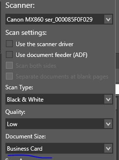

# How to Organize Documents Using eDoc Organizer

Organizing documents in eDoc Organizer is different than organizing documents in other systems. While most people are used to using folders and subfolders to store and organize files, eDoc Organizer uses a labeling system. This system is different than what most of our users are used to, and this is by design. Documents are accessed in a more efficient and better-organized system with labels.

**Labels vs. Folders**
eDoc Organizer uses a system of labels instead of folders for categorizing files. Labels provide a streamlined system that helps boost organizational efficiency. Rather than filing a document under a single folder, labels allow users to assign multiple categories to a document. This means that each document can be found under multiple categories, and each category can be combined with others to help find documents quickly.

**Folders**
Most people have experience using hierarchical folders with very specific names. However, with this organizational method a single document can only be sorted into one folder. For example, say you want to file bills for your home. You might create a folder for utility bills like electricity, gas, water, and phone. You might file all the bills underneath a single “utilities” folder, or you might make subfolders for each month, or each bill. Soon, you have a large number of folders and subfolders and it’s easy to forget which bill goes where.

Suppose at the end of the year you'd like to view all the bills for March 2012. Since you have multiple bills for March, each with separate folders, you’d have to open several multiple folders and sift through all the documents to find the specific bills for March. This can become cumbersome and time consuming.

**Labels**
Suppose you organize the same bills using tags. By assigning multiple tags to each document you'll have a way to sort and pull whichever bill you'd like. For example, you might assign the following tags to your electricity bill: March, 2012, electric, utility. This allows you to have the bill "filed" under four separate categories and you can sort and filter using any of these labels. Each utility bill is organized in the same manner. The more labels you assign to a single document, the greater the specificity and search efficiency.

Now, if you want to narrow the search down to all utility bills for March 2012, you’d search “2012”, “March”, and “Utility”. Or maybe you want to view all of your phone bills for the last 2 years. In this case, you’d simply search “phone”, “2010”, and “phone”, “2011”. That’s it! No sifting, sorting, or wasting your time searching through folders.

**Organizing Documents for Multiple Users**
In addition to streamlining and saving search time, eDoc Organizer’s labeling system creates clarity amongst multiple users.

It can be difficult coordinating folder names and locations with multiple users, and often, a document can be misfiled or lost in an incorrect folder. Labels eliminate this confusion. Labels are visible in the side-bar of eDoc, enabling all users to see the current, appropriate labels to be used.

For example, a medical office can create patient labels based on last name, month of service, type of treatment, insurance company, etc. All employees of the office can easily navigate the files and label them appropriately. Labels eliminate confusion and keep office processes running smoothly.

**Some Tips on Using Labels**
– Labels should be considered categories rather than folders. Folders are restrictive while labels are designed to be broad.

– Multiple labels should be assigned for each document uploaded in order to maximize efficiency and specificity. Because labels are different than folders, they are best used when several labels are applied to a single document.

– Move from general to specific. Begin with a general label, “2012” for instance, and move to more specific labels. For example, labels for your bank statements might look something like this: 2012>March>US Bank>Checking. You might have something similar for your savings account, where “checking” would be replaced by “savings”.

– Use the Label Search feature in eDoc to find specific documents quickly.

# Adding/editing/deleting/arranging labels

Adding a new label: 
1. In the label panel to the right of the user interface, click the add button that is a green circle with a white plus symbol in it.  
2. The create label screen will come up, here you can choose a color for the label, choose the label group, and the name of the new label.  You can also add words to the text box that will be used to suggest this label for future documents. 
3. Click "OK" and your new label will be created and added to your labels. 

Editing a label: 
1. To edit a label, click on the label you would like to edit, and then click on the edit button.  The edit button looks like a pencil at the top of your label panel bar.  
2. The edit label screen will appear.  Here you can edit the color of the label, the label group, the name of the label or the automatic label suggestion text.
3. Click "Ok" to save.  The edited label will be reflected in the label list.  

Deleting a Label:
1. To delete a label, select the label from the list by clicking on it to select it.  Next choose the delete button at the top of the label panel bar, it looks like a red circle with a white "x" in it.  
2. The "delete label confirmation" message box will appear to ask you to confirm the deletion of the selected label, click "ok" 
3. The label will be removed from the list. 

Arranging Labels: 
1. Choose a label to move by clicking on it.  Use the blue arrows at the top of the label panel bar to arrange the order of the labels.

# Integrate eDoc Organizer with Gmail

eDoc Organizer will work with most email clients like Microsoft Outlook, Outlook Express or Microsoft Live Mail. To integrate it with Gmail, you have to enable POP access to your Gmail account and setup one of these clients on your computer. Once you have completed that process, eDoc Organizer will be able to share documents via email using your Gmail account.

You can find Google’s instructions on enabling POP access and setting up the client of your choice at [http://mail.google.com/support/bin/answer.py?answer=13273](http://mail.google.com/support/bin/answer.py?answer=13273).

Just because you setup this new way of accessing your Gmail account, doesn’t mean you have to use this method for all your day to day correspondence. You can continue access Gmail via the web, this method is only needed to enable eDoc Organizer to send documents via your Gmail account.

# How to Scan in Business Cards using eDoc Organizer

What appears on screen after you scan the business card is partly dependent on the  scanner you are using and partly dependent on the settings you are using within eDoc Organizer. The first thing to try is to see if your scanners driver has an option to correctly scan a document that is the size of a typical business card (3.5 by 2 inches). If it does, the option would be automatically listed under the document size drop-down in the scan document wizard.

If this option is not available, we recommend that you scan using your scanners driver. You can do that by enabling the option as shown below.

This will open the application that your scanner manufacturer ships with your device and it might be able to automatically detect the size of the business card without you have to specify the size for the document.

Finally if all fails you can manually reset the size of the scanned page to the correct size, by using the Manual or Automatic crop buttons in the Scan Document Wizard.

# How to set up eDoc Organizer Folder Monitoring

To set up folder monitoring simply open up your eDoc Organizer and go to the _**Tool**_ bar. Under _**Tool**_ drop down to _**configure folder monitors**_, where you will click on _**add**_. This will open a window where you can choose the folder that will be monitored, add labels that will be automatically added to the documents and designate where the documents will be moved to outside of eDoc Organizer. To choose to delete the file from the folder select _**delete source files**_. Be sure to click the _**Save**_ button when you have selected the settings you prefer.

Folders are monitored for new files only when eDoc Organizer is running. Any files added when eDoc Organizer is closed are imported the next time the program is started.

To edit folder monitors simply go back to _**Tool->Configure Folder Monitors**_ choose the folder that you wish to edit from the list of folders you are having eDoc Organizer monitor, and select _**Edit**_. Make the changes you wish and then be sure to _**save**_ your work. To delete a folder monitor you would go to the same location but chose the _**delete**_ option. You will be asked to confirm that you want to delete the folder monitor.

# How to turn on automatic label suggestions

Turning on Automatic Label Suggestions for a particular label  
Let’s say that you wanted to apply the label “My Company” to all documents that contained the name of your company. We will use Contoso as the company name in this example.

Click on the New Label button to create a new Label.

_Note: If you already have a label for “My Company” you can just edit it to enable ALS as well._

In the Label dialog fill in the information shown above and create the label. Note that the “Suggest this label for documents” check box is checked and the word Contoso is added below it as a word to be searched in the document’s content for this label to be suggested.

Now when a document with the word contoso is imported into eDoc Organizer, eDoc Organizer automatically suggests “My Company” Label as a possible candidate to be applied to the document.

The Invoice Label is automatically suggested above as well because the word Invoice is present in the document as well. Here is what the Invoice label configuration looks like:

Now lets say that your company recently changed its name to Contoso and it used to be called Acme before that. In that case, you want to ensure that any old documents you import into eDoc organizer also get the “My Company” Label. But the old documents don’t have the word Contoso in them, they have the word Acme in them. That is not a problem. You can change the “My Company” Label to be suggested for both of those words as shown below.

Now when we import an old document with Acme in the text the “My Company” Label is suggested as well.

**Recommendations to get the most out of Automatic Label Suggestions**

1. Use precise rather than generic words as triggers for Automatic Label Suggestions. For example, it might be better to use your bank’s actual name rather than the generic term bank to apply the label to all your bank statements. This will ensure that the label is not wrongly suggested in a lot of other documents that might have the word bank in them but are not your banks statement.

2. It is better to provide more than one word for ALS. In cases where the document is scanned, ALS relies on accurate Optical Character Recognition (OCR) to find the words in the documents. The more unique words you provide as ALS triggers, the more chances you have of finding a match.

3. Automatic Label Suggestions is a convenience feature and is not guaranteed to have an 100% accurate detection rate. Inaccurate OCR or a word that you think should be in the document, not being there can cause inaccurate ALS suggestions. It is always advisable to review the labels suggested by eDoc Organizer and adjust them before applying them to the document.

# Scan a multi-page document using eDoc Organizer

The best way to scan a multi-page document depends upon the capabilities of your scanner. If your scanner has an Automatic Document Feeder (ADF) then using it will allow you to scan all the pages of a document at the same time. But even if your scanner doesn’t have an ADF, you can still scan the pages of your document one-at-a-time and save them as a single document in eDoc Organizer.

**Scanning a multi-page document with Automatic Document Feeder (ADF)**

1. Open eDoc Organizer.

2. Click on the Scan button in the upper left hand corner of the main window.

3. This will open the scan document wizard.

_If your scanner has an ADF the option to Use document feeder (ADF) will be available in this window. If this option is unavailable then eDoc Organizer is unable to detect that your scanner has ADF. In this situation please use the Scan a multi-page document without ADF procedure below to scan your document._

4. Place the pages of your document in the feeder.

5. Enable the checkbox beside Use document feeder (ADF) option and click on the Scan button.

6. eDoc Organizer will scan all the pages in the ADF one at a time. When the scanning is complete press the “Save and Finish” button to save all the pages in a single PDF file within eDoc Organizer.

**Scanning a multi-page document without Automatic Document Feeder (ADF)**

1. Open eDoc Organizer.

2. Click on the Scan button in the upper left hand corner of the main window.

3. This will open the scan document wizard.

4. Place the first page of the document in your scanner and click the Scan button.

5. When eDoc Organizer finishes scanning the first page of your document, the Scan button will be replaced by three new buttons: Append, Scan and New, and Scan and Finish.

6. Place the next page of your document and click the Append button.

7. Repeat step 6 for the rest of the pages of your document.

8. Once you have scanned all the pages of your document, press the “Save and Finish” button to save all the pages in a single PDF file within eDoc Organizer.